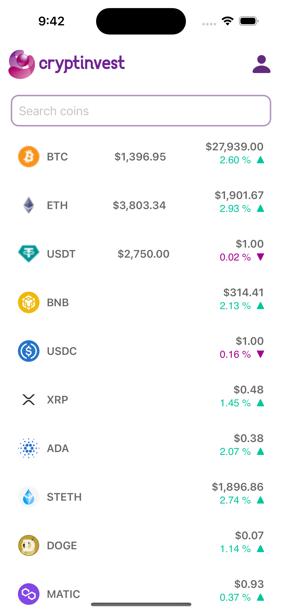
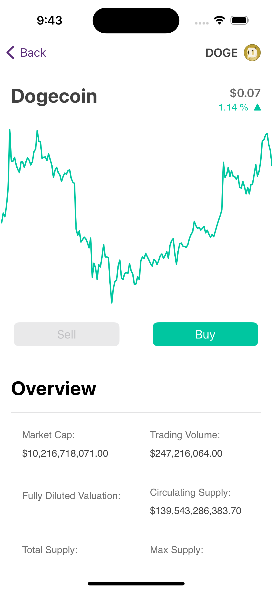
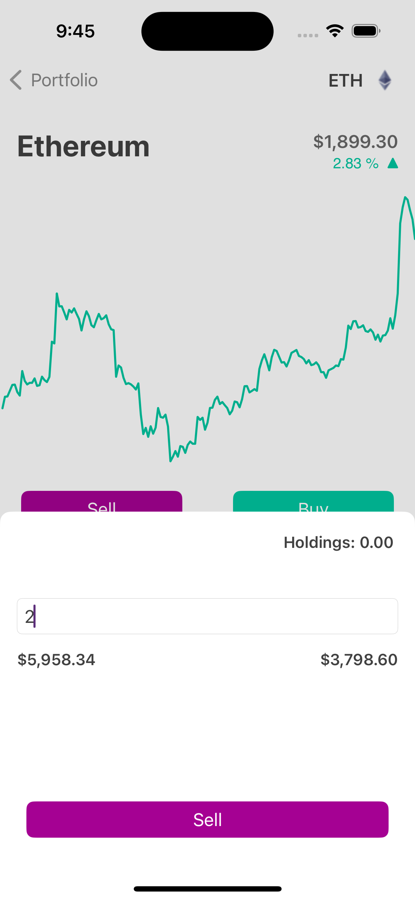

# Cryptinvest
Cryptinvest is an imaginary trading game around crypto currencies.
This app is meant for study and not for gambling and/or finacial advice.
This project is opensource and can be used in any way possible.
Feel free to clone, reuse and improve codebase.

## Features
- User is provided with $10,000.00 fake money on first interaction with the app.
- User initial/further data will be saved within Device storage.
- User will have the list of assets provided by Coingecko API in the main page.
- User will be able to navigate on each asset for its respective details.
- User will be able to buy and sell assets.
- User will be able to track gains and losses.

## Technology
- SwiftUI
- UIKit
- CoreData
- SQLite
- Async/Await
- XCTTest
- Coingecko API

## Architecture
This project is build with MVVM-C and follows the Clean Architecture design.
It is also build around Protocol Oriented Programming.
Consumes several techniques of design patterns.

## Screenshots

